# Servicios AWS utilizados

|Servicio|Función|
|---|---|
|**Amazon S3**|Almacena los archivos de la web estática.|
|**CloudFront**|CDN que distribuye la web con mayor rendimiento y HTTPS.|
|**IAM**|Permisos para Terraform y acceso seguro a AWS.|
|**AWS CLI**|Permite autenticar Terraform mediante credenciales locales.|

---

# Flujo de funcionamiento

```
Usuario
    │
    ▼
CloudFront
    │
    ▼
S3 Bucket
    │
    ├── index.html
    ├── style.css
    └── script.js
```

---

# Recursos que creará Terraform

```
terraform/

provider.tf
versions.tf
main.tf
variables.tf
outputs.tf
terraform.tfvars
```

Terraform desplegará automáticamente:

```
AWS

├── S3 Bucket
│
├── Bucket Website Configuration
│
├── Bucket Policy
│
├── CloudFront Distribution
│
└── Outputs
```

---

# Organización del laboratorio

```
01-static-website
│
├── terraform/
│
├── website/
│
├── diagrams/
│
├── images/
│
├── docs/
│
└── README.md
```

## Organización del laboratorio en Github

``` text
aws-labs
│
├── README.md
├── LICENSE
├── .gitignore
├── docs
│   └── roadmap.md
├── templates
│   └── README-template.md
└── labs
    ├── 01-static-website
    │   ├── README.md
    │   ├── diagrams
    │   │   ├── architecture.drawio
    │   │   └── architecture.png
    │   ├── docs
    │   │   ├── architecture.md
    │   │   ├── deployment.md
    │   │   └── lessons-learned.md
    │   ├── images
    │   ├── scripts
    │   │   └── deploy.ps1
    │   ├── terraform
    │   │   ├── main.tf
    │   │   ├── outputs.tf
    │   │   ├── provider.tf
    │   │   ├── terraform.tfvars
    │   │   ├── variables.tf
    │   │   └── versions.tf
    │   └── website
    │       ├── index.html
    │       ├── error.html
    │       ├── css
    │       │   └── style.css
    │       ├── js
    │       │   └── script.js
    │       └── images
    ├── 02-vpc
    ├── 03-ec2
    ├── 04-cloudwatch
    ├── 05-iam
    ├── 06-lambda
    ├── 07-ecs
    ├── 08-cicd
    └── 09-final-project

```


## ¿Cómo funcionan los archivos Terraform?

| Archivo            | Función                                                        | ¿Se modifica mucho? |
| ------------------ | -------------------------------------------------------------- | ------------------- |
| `provider.tf`      | Configura el proveedor que usará Terraform (AWS en este caso). | Poco                |
| `versions.tf`      | Define las versiones mínimas de Terraform y del proveedor AWS. | Muy poco            |
| `main.tf`          | Contiene los recursos principales que se crearán en AWS.       | Mucho               |
| `variables.tf`     | Declara las variables que utilizará el proyecto.               | Poco                |
| `terraform.tfvars` | Asigna valores a las variables definidas en `variables.tf`.    | Bastante            |
| `outputs.tf`       | Muestra información útil al terminar el despliegue.            | Poco                |


---

# Resultado esperado

Al finalizar el laboratorio Tendremos lo siguiente:

```
Internet
     │
     ▼
https://xxxxxxxx.cloudfront.net
     │
     ▼
Página web estática funcionando
```

---

# Servicios que se usan
- Amazon S3
- Static Website Hosting
- Bucket Policies
- CloudFront
- IAM
- AWS CLI
- Terraform
- Git
- GitHub

---

# Diagrama Estructural
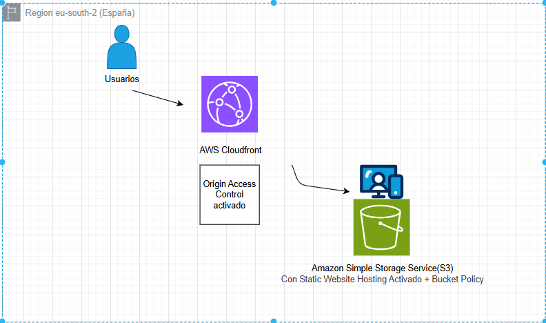


---
---
---


# Creación del Lab en la consola de AWS


### Bucket S3

S3 nos permite almacenar datos como objetos, dentro de S3 se crean lo que se llaman buckets; estos buckets o cubos/cajones como queramos llamarlos nos permitirá guardar todos los archivos necesarios para nuestra página web para posteriormente pasar a su Web Hosting integrado.

Crearemos un bucket donde meteremos todos nuestros archivos necesarios para nuestra sencilla página web estática:
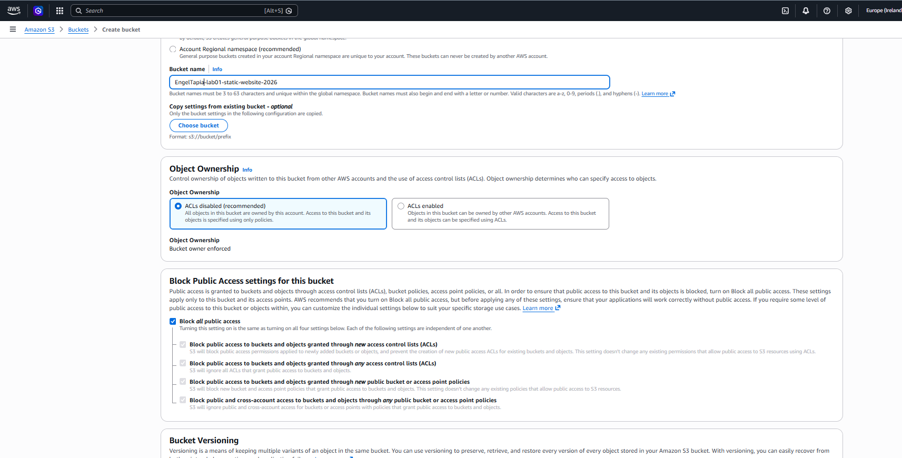

Logramos una arquitectura con Cloudfront + OAC, así que podemos dejar el bloqueo al acceso público activado(es la mejor práctica). Se explicará lo que es OAC en Cloudfront más en siguientes apartados.


## Subida de archivos web al bucket creado

Tras tener el bucket creado, subiremos los archivos de nuestra página web, en mi caso es una web creada con IA para ahorrar tiempo en este pequeño laboratorio, es sencilla pero esta configuración y estructura puede entrar también dentro de páginas web de pymes etc.

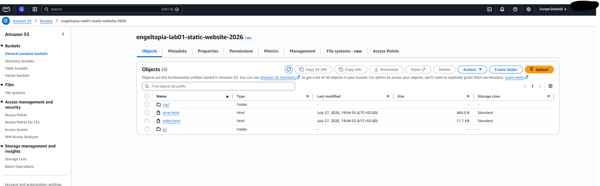
---


## Creación de la distribución de Cloudfront


Cloudfront es un servicio de Content Delivery Network.  cachea contenido en cientos de Edge Locations repartidas por el mundo, para servirlo mucho más cerca y más rápido del usuario final que si viniera siempre desde el origen. Una **Distribution** define uno o varios **Origins** (S3, un ALB, o incluso un servidor HTTP externo fuera de AWS).

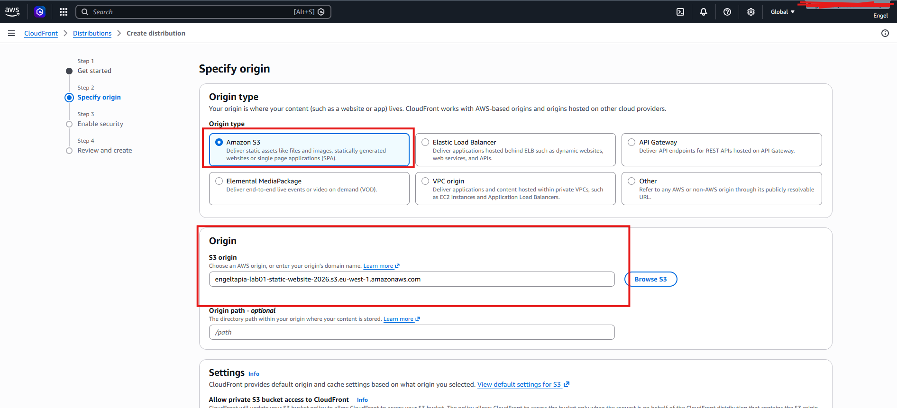


Cloudfront automáticamente nos crea una Política de Bucket, que es el conjunto de reglas de acceso para nuestro bucket. En este caso se aprueba el acceso al bucket al servicio de Cloudfront, pero ojo solo a cloudfront y sólo a este bucket.

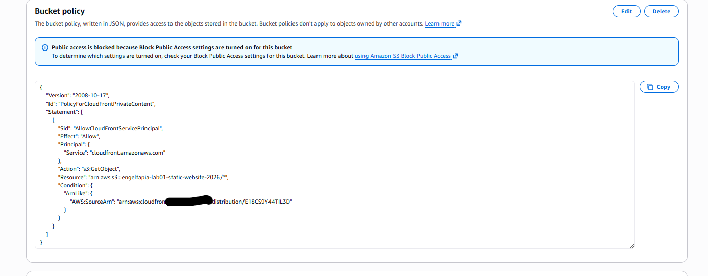

---


## Comprobación del dominio dado por Cloudfront
https://d1prrhe2wjp8xa.cloudfront.net/
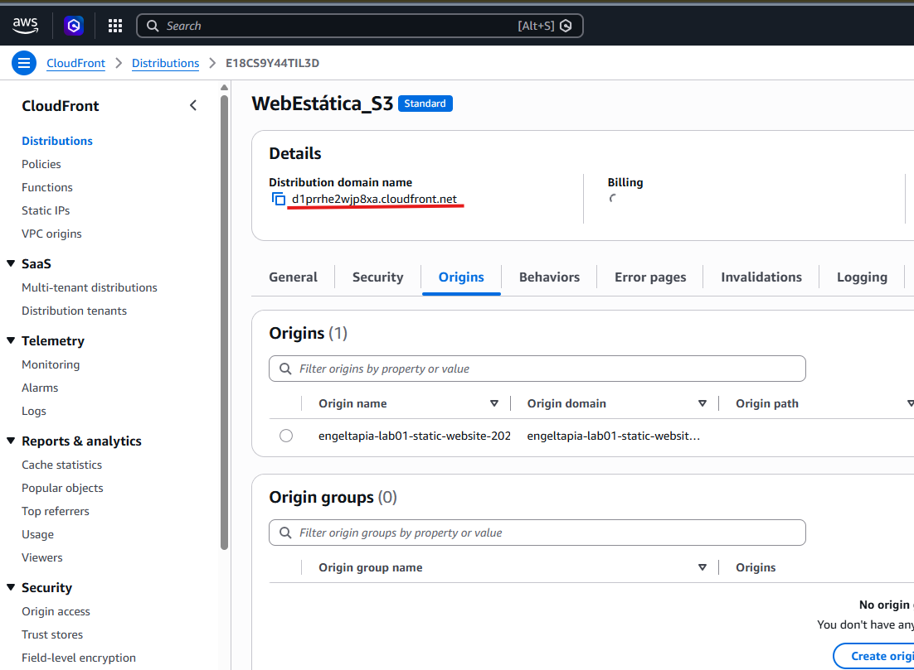


Tras haber comprobado el correcto funcionamiento del enlace, podemos decir que tenemos nuestra página web estática lista. En caso de querer tenerla registrada con un nombre de dominio y Certificados gestionados por AWS se necesita incluir servicios como route 53 DNS y AWS ACM para gestionar los certificados públicos para dominios que exactamente sean públicos.

---


## ¿Puedo hacerlo con un solo click?
Claro, para eso tenemos lo que es la famosa infraestructura como código (IAC), nos permite definir todos los servicios y parámetros deseados en lenguaje declarativo.
 
En este caso lo haremos con la herramienta Terraform que lo vemos en el directorio llamado Terraform.
 
### ¿Qué es?

Terraform aplica infraestructura como código IAC normalmente utilizada por DevOps.
Terraform es una herramienta para automatizar la creación, gestión y configuración de infraestructura de manera declarativa.

Lee todos los archivos automáticamente que acaban en ".tf" del directorio. 

## ¿Cómo funcionan los archivos Terraform?

| Archivo            | Función                                                        | ¿Se modifica mucho? |
| ------------------ | -------------------------------------------------------------- | ------------------- |
| `provider.tf`      | Configura el proveedor que usará Terraform (AWS en este caso). | Poco                |
| `versions.tf`      | Define las versiones mínimas de Terraform y del proveedor AWS. | Muy poco            |
| `main.tf`          | Contiene los recursos principales que se crearán en AWS.       | Mucho               |
| `variables.tf`     | Declara las variables que utilizará el proyecto.               | Poco                |
| `terraform.tfvars` | Asigna valores a las variables definidas en `variables.tf`.    | Bastante            |
| `outputs.tf`       | Muestra información útil al terminar el despliegue.            | Poco                |

---
---
---
-
-
-
----


# Creación automatizada

Se puede ver el código en el directorio llamado "Terraform".

## Comando usados

| Comando                                               | Función                                                                            | Ejemplo                                        |
| ----------------------------------------------------- | ---------------------------------------------------------------------------------- | ---------------------------------------------- |
| `terraform init`                                      | Inicializa el proyecto, descarga los providers y módulos.                          | `terraform init`                               |
| `terraform fmt`                                       | Formatea el código siguiendo el estilo oficial.                                    | `terraform fmt`                                |
| `terraform validate`                                  | Comprueba que la sintaxis del código es válida.                                    | `terraform validate`                           |
| `terraform plan`                                      | Genera un plan de ejecución. Muestra los cambios que se realizarán sin aplicarlos. | `terraform plan`                               |
| `terraform apply`                                     | Aplica los cambios en la infraestructura.                                          | `terraform apply`                              |
| `terraform destroy`                                   | Elimina todos los recursos creados por Terraform.                                  | `terraform destroy`                            |
| `terraform output`                                    | Muestra los valores definidos en `outputs.tf`.                                     | `terraform output`                             |
| `terraform show`                                      | Muestra el estado o un plan de Terraform.                                          | `terraform show`                               |
| `terraform state list`                                | Lista todos los recursos almacenados en el estado.                                 | `terraform state list`                         |
| `terraform state show`                                | Muestra la información de un recurso del estado.                                   | `terraform state show aws_s3_bucket.web`       |
| `terraform import`                                    | Importa un recurso existente al estado de Terraform.                               | `terraform import aws_s3_bucket.web mi-bucket` |
| `terraform taint` _(obsoleto en versiones recientes)_ | Marca un recurso para recrearlo.                                                   | `terraform taint aws_instance.web`             |
| `terraform workspace list`                            | Lista los workspaces disponibles.                                                  | `terraform workspace list`                     |
| `terraform workspace new`                             | Crea un nuevo workspace.                                                           | `terraform workspace new dev`                  |
| `terraform workspace select`                          | Cambia de workspace.                                                               | `terraform workspace select prod`              |
| `terraform version`                                   | Muestra la versión instalada.                                                      | `terraform version`                            |


Tras tener todo creado y automatizado con Terraform y el código revisado vamos a probarlo:

```terraform plan```
 que nos muestra los recursos a crear antes de nada (no se incluye capturas de los demás para resumir el documento):

la política del bucket:
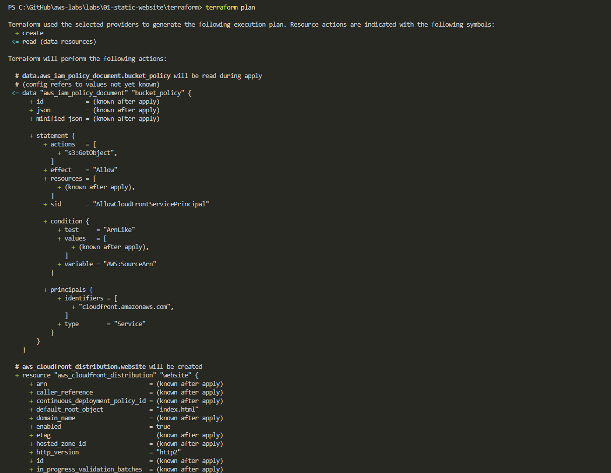


Los objetos que se crearán dentro del bucket
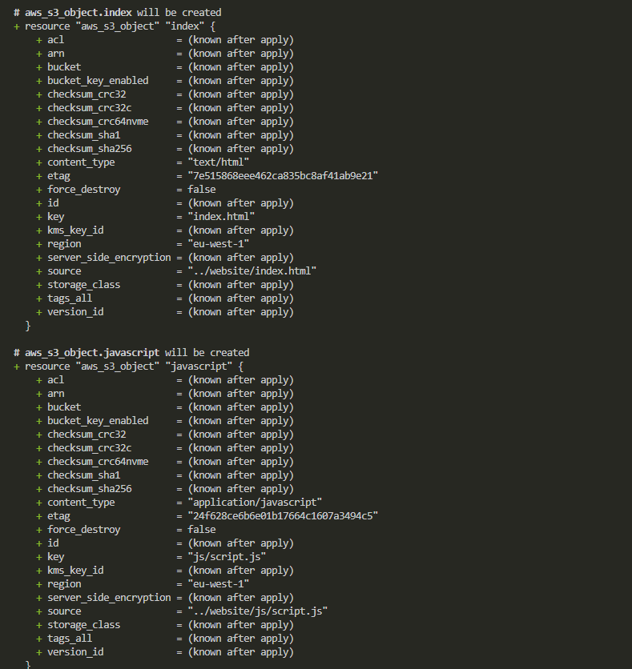


La distribución de cloudfront
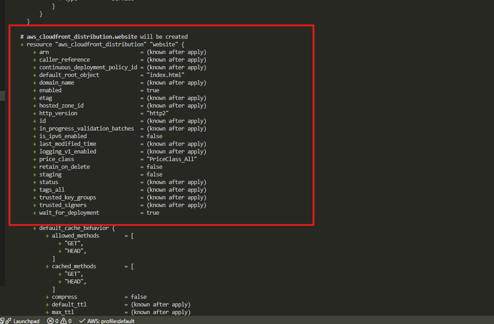


---

## Creación de los recursos y comprobación


``terraform apply``  Creará los recusos para luego pasar a comprobarlos.
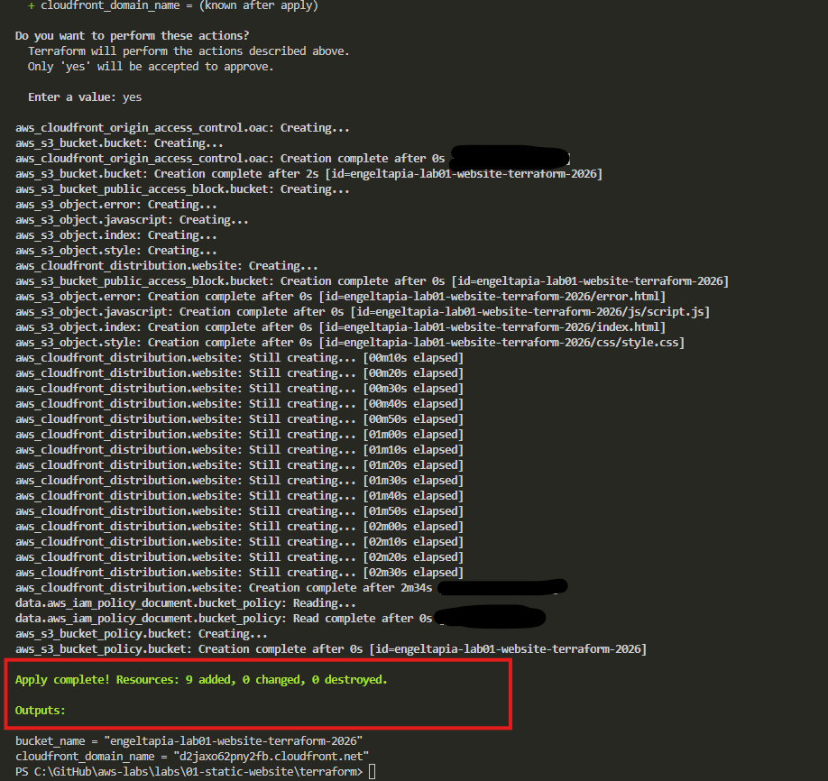

Nos sale el nombre de dominio que cloudfront dió a nuestra web estática ya que en el archivo de outputs.tf de terraform pusimos el siguiente código para que lanzara el Domain Name al aplicarse todo:

``` hcl
output "cloudfront_domain_name" {
  value = aws_cloudfront_distribution.website.domain_name
}

```


---
----
---

# Comprobación Final de la creación

Nos dirigimos a la consola y verificamos que todo esté creado como lo especifiqué:

### Bucket S3 listo:
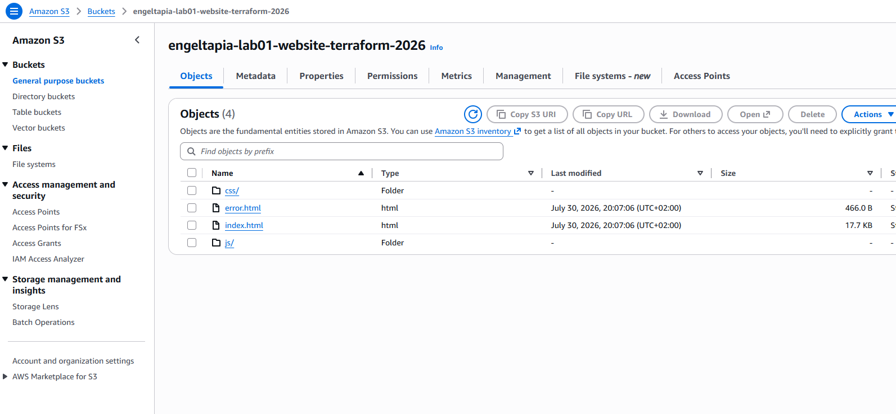

### Bucket Policy listo

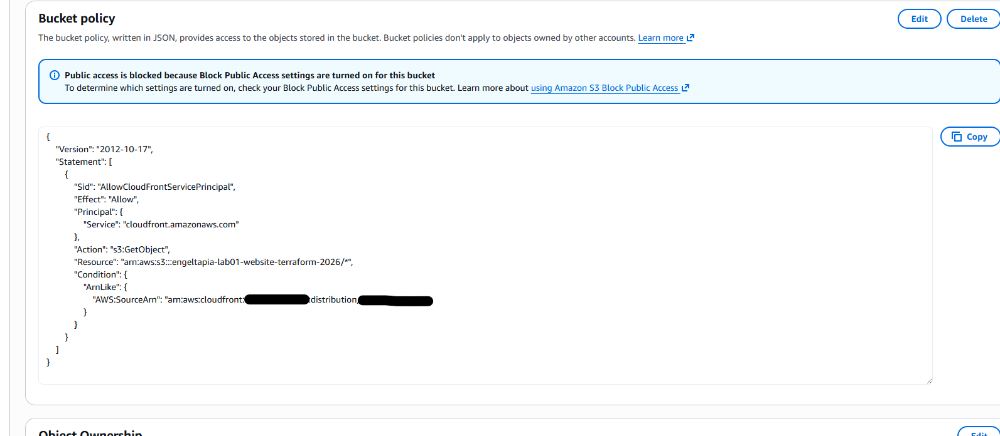

### Distribución de cloudfront lista y funcionando

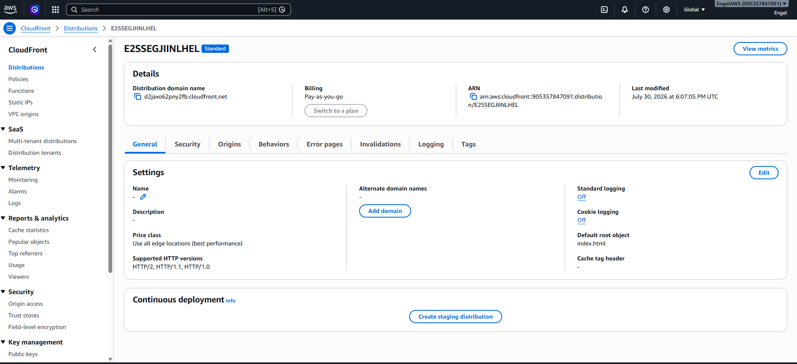

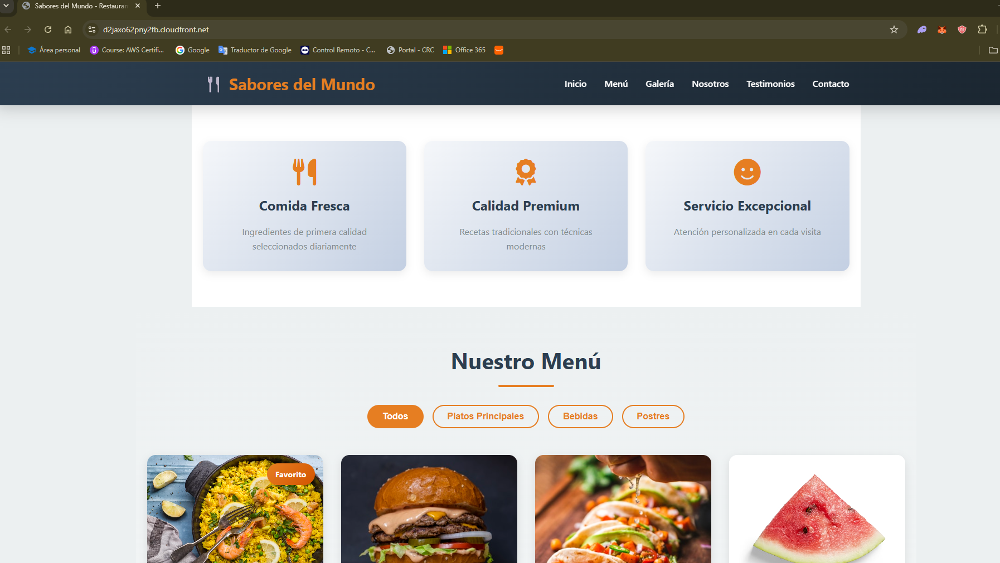

