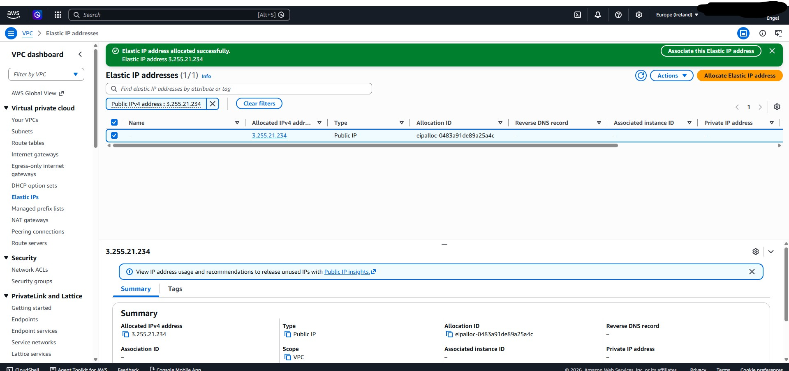

# Despliegue del Laboratorio 02 - Red Corporativa en AWS

# Objetivo

En este laboratorio se construye una red privada en AWS utilizando Terraform. El objetivo es comprender cómo se comunican los recursos dentro de una VPC, cómo se proporciona acceso a Internet y por qué AWS separa los recursos públicos y privados mediante subredes.

Al finalizar este laboratorio seré capaz de:

* Comprender la estructura de una VPC.
* Diferenciar una subred pública de una privada.
* Entender el funcionamiento de un Internet Gateway.
* Comprender el propósito de un NAT Gateway.
* Configurar tablas de rutas.
* Automatizar toda la infraestructura utilizando Terraform.

---

# Arquitectura del laboratorio

La infraestructura desplegada será la siguiente:

```
AWS
│
├── VPC
├── Public Subnet
├── Private Subnet
├── Internet Gateway
├── Elastic IP
├── NAT Gateway
├── Public Route Table
├── Private Route Table
├── Route Table Associations
└── Outputs
```

---

# Virtual Private Cloud

Una Virtual Private Cloud (VPC) es una red virtual completamente aislada dentro de AWS. Funciona de forma similar a una red corporativa tradicional, permitiendo definir direcciones IP, subredes, rutas y reglas de comunicación.

Todos los recursos que despleguemos en los siguientes apartados vivirán dentro de esta VPC.


### Creación: lab02-vpc


---

# Planificación del direccionamiento IP

Antes de crear una red es importante planificar el espacio de direcciones.

En este laboratorio se utilizaremos un bloque CIDR para la VPC que posteriormente se dividirá en dos subredes.


```
VPC
10.0.0.0/16

Public Subnet
10.0.1.0/24

Private Subnet
10.0.2.0/24
```

Esto facilita la organización y evita conflictos cuando la infraestructura crezca. Veremos que hay varias herramientas/servicios que nos permitirán que la subred pública como privada tengan acceso a internet de forma segura.

---

# Subred pública

Una subred pública es aquella cuyos recursos pueden comunicarse directamente con Internet.

Esto es posible porque su tabla de rutas contiene una ruta hacia un Internet Gateway (una de las herramientas que mencioné).

En los siguientes laboratorios esta subred alojará recursos como servidores web o balanceadores de carga.

---

## Subred Pública: 10.0.1.0/24


Para crear la subred pública se da por hecho que sabemos que debemos asociarla a nuestra VPC, y así sucede con cada recurso dentro de nuestra VPC.


La subured pública es la que contendrá los servicios como el Internet Gateway, y el Nat Gateway


- Internet Gateway: permite la salida de nuestros recursos que queramos que sean públicos y accesibles desde internet.
- Nat Gateway: Hace que nuestros recursos dentro de la subred privada puedan acceder a internet pero no puedan ser accesibles desde este.


---

# Subred privada

Una subred privada está diseñada para alojar recursos que no deben ser accesibles desde Internet.

Los recursos pueden seguir descargando actualizaciones gracias al NAT Gateway, pero no reciben conexiones entrantes desde el exterior.


Aquí suelen desplegarse:

* Bases de datos
* Servidores internos
* Aplicaciones backend

---

# Internet Gateway

El Internet Gateway es el componente que conecta la VPC con Internet.

Sin este recurso, ninguna instancia podría comunicarse con el exterior, aunque estuviera ubicada en una subred pública.


debe apreciarse:

* Estado Attached: asociada a nuestra VPC
* VPC asociada

---

# Elastic IP

Una Elastic IP es una dirección IPv4 pública estática.

En este laboratorio será utilizada por el NAT Gateway para que los recursos privados puedan acceder a Internet.


Debe verse:

* Public IP
* Allocation ID

---

# NAT Gateway

El NAT Gateway permite que los recursos ubicados en la subred privada puedan salir a Internet sin ser accesibles desde el exterior.



---

# Tablas de rutas

Las tablas de rutas indican hacia dónde debe enviarse el tráfico.

En este laboratorio existen dos.

## Public Route Table

La tabla pública contiene una ruta hacia el Internet Gateway.

Gracias a ella, cualquier recurso de la subred pública puede acceder a Internet.


---

## Private Route Table

La tabla privada envía el tráfico destinado a Internet hacia el NAT Gateway.

De esta forma, las instancias privadas pueden salir a Internet sin exponerse públicamente.


---

# Asociaciones de las tablas de rutas

Cada subred debe estar asociada a una tabla de rutas.

La subred pública utilizará la tabla pública.

La subred privada utilizará la tabla privada.

Si esta asociación fuese incorrecta, la comunicación de la red dejaría de funcionar correctamente.


---
# Comprobaciones de la comunicación

Dentro de subred pública he creado una instancia. En cambio en la privada consta de 2 instancias, esto ya que quiero que se vea que la comunicación entre instancias de distinta red no es efectiva, por otro lado en la misma red sí. 


Se verifica que las instancias de la subred privada se comunican y acceden a internet pero no son accesibles desde este por lo que claramente no constan de Ips públicas.

---
---
---

# Conclusiones

Este laboratorio ha servido para comprender los componentes fundamentales de una red en AWS y cómo se relacionan entre sí.

Aunque la infraestructura es sencilla, representa la base sobre la que se desplegarán los siguientes laboratorios del repositorio. A partir de esta VPC será posible añadir instancias EC2, balanceadores de carga, bases de datos y otros servicios sin necesidad de rediseñar la red.

