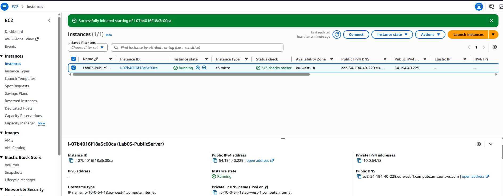
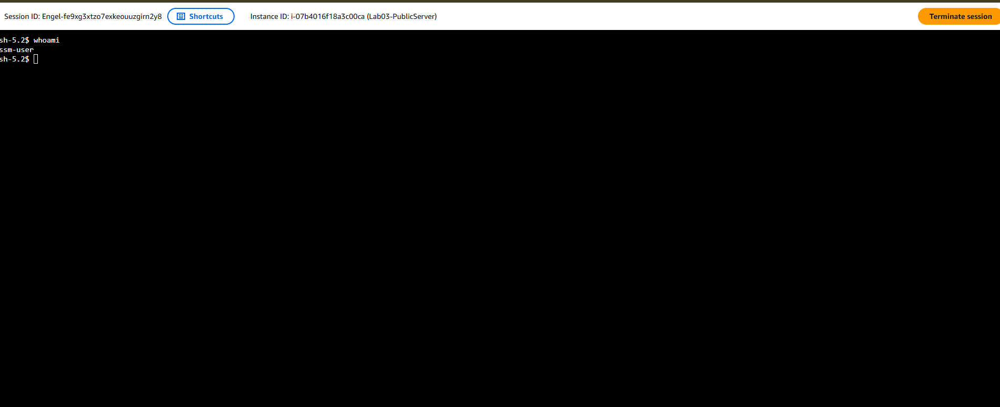
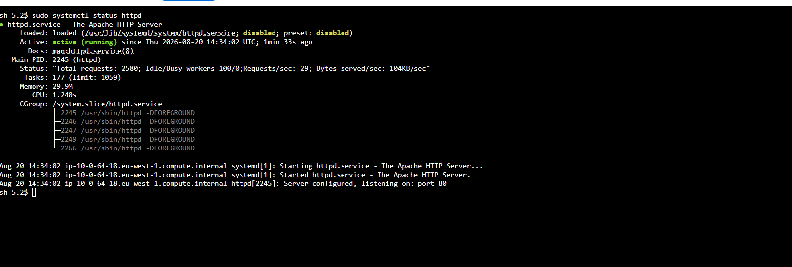
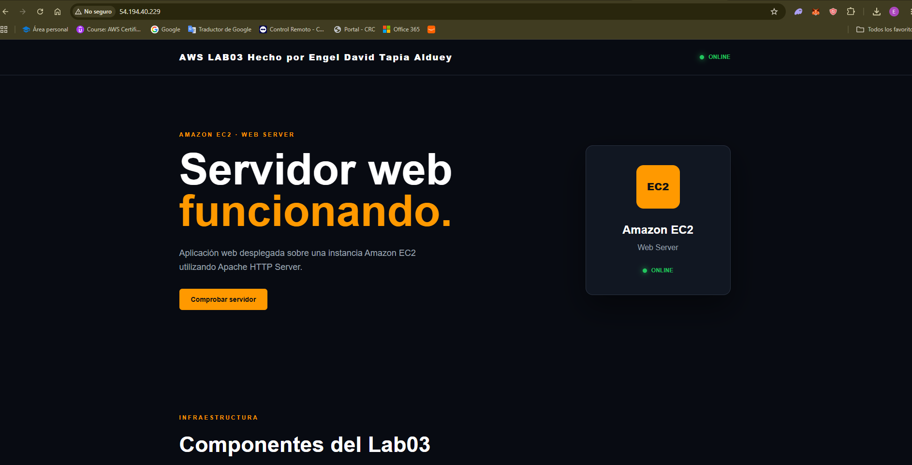

# LAB03 — Servidor Web con Amazon EC2

## 1. Descripción

En este laboratorio se despliega un servidor web utilizando **Amazon EC2** dentro de una **VPC personalizada**.

El objetivo es aprender a desplegar una instancia EC2, configurar su red y almacenamiento, permitir el acceso HTTP/HTTPS y administrar la instancia mediante **AWS Systems Manager Session Manager**, evitando depender de SSH.

Además, se despliega una página web sencilla compuesta por:

- HTML
- CSS
- JavaScript

---

## 2. Objetivos

Los objetivos principales del laboratorio son:

- Crear y configurar una instancia EC2.
- Comprender el funcionamiento de una subnet pública.
- Configurar un Internet Gateway.
- Configurar una tabla de rutas.
- Configurar un Security Group.
- Utilizar Amazon EBS como almacenamiento de la instancia.
- Configurar IAM para permitir la administración mediante SSM.
- Administrar la EC2 mediante Session Manager.
- Instalar y configurar un servidor web.
- Publicar una página web accesible desde Internet.
- Comprender el funcionamiento de una IP pública y Elastic IP.
- Monitorizar y consultar los logs del servidor.
- Automatizar la infraestructura utilizando Terraform.

---

## 3. Arquitectura

La arquitectura utilizada en el laboratorio es:

```text
                         INTERNET
                             │
                             ▼
                    ┌─────────────────┐
                    │ Internet Gateway│
                    └────────┬────────┘
                             │
                             ▼
                ┌─────────────────────────┐
                │          VPC            │
                │       10.0.0.0/16       │
                │                         │
                │   Public Subnet         │
                │    10.0.1.0/24          │
                │                         │
                │    ┌──────────────┐     │
                │    │     EC2      │     │
                │    │ Web Server   │     │
                │    └──────┬───────┘     │
                │           │             │
                │          EBS            │
                │                         │
                └─────────────────────────┘
                             │
                             │
                       AWS Systems Manager
                             │
                             ▼
                          Session
                          Manager
```

---

## 4. Componentes AWS

### VPC

Se utiliza una VPC personalizada para aislar los recursos del laboratorio.

- CIDR: `10.0.0.0/16`

### Public Subnet

La instancia EC2 se encuentra dentro de una subnet pública.

- CIDR: `10.0.128.0/24`
- La subnet dispone de una ruta hacia Internet mediante el Internet Gateway.

### Internet Gateway

El Internet Gateway permite la comunicación entre la VPC e Internet.

La tabla de rutas contiene una ruta por defecto:

```
0.0.0.0/0 → Internet Gateway
```

---

## 5. Amazon EC2

La aplicación web se ejecuta sobre una instancia EC2.

La instancia funciona como servidor web y aloja los archivos:

- `index.html`
- `style.css`
- `script.js`

La estructura lógica del servidor es:

```text
EC2
│
├── Sistema operativo
│
├── Servidor web
│
└── /var/www/html
    ├── index.html
    ├── style.css
    └── script.js
```

---

## 6. Security Group

El Security Group controla el tráfico permitido hacia la instancia.

Reglas principales:

| Protocolo | Puerto | Origen        | Uso                          |
|-----------|--------|---------------|-------------------------------|
| HTTP      | 80     | 0.0.0.0/0     | Acceso web                    |
| HTTPS     | 443    | 0.0.0.0/0     | Acceso web seguro             |
| SSH       | 22     | No necesario  | Administración                |
| SSM       | -      | AWS           | Administración mediante Session Manager |

La administración se realiza preferentemente mediante Systems Manager Session Manager, por lo que no es necesario exponer el puerto 22 a Internet.

---

## 7. EBS

La instancia EC2 utiliza un volumen Amazon EBS como almacenamiento.

EBS permite que el sistema operativo, aplicaciones y archivos de la página web se almacenen en un volumen persistente.

Conceptualmente:

```text
EC2
 │
 └── EBS Volume
       │
       ├── Sistema operativo
       ├── Servidor web
       └── Archivos de la página web
```

---

## 8. IAM

La instancia EC2 utiliza un IAM Role para poder comunicarse con AWS Systems Manager.

El flujo es:

```text
EC2
 │
 ▼
IAM Role
 │
 ▼
Systems Manager
 │
 ▼
Session Manager
```

Esto permite administrar la instancia sin necesidad de utilizar una clave SSH.

---

## 9. AWS Systems Manager

Se utiliza AWS Systems Manager Session Manager para acceder a la instancia.

Ventajas:

- No requiere abrir SSH.
- No requiere administrar claves privadas.
- Permite acceder a la terminal de la EC2 desde AWS.
- Permite centralizar la administración.
- Mejora la seguridad de la infraestructura.

Flujo:

```text
Administrador
      │
      ▼
AWS Console
      │
      ▼
Systems Manager
      │
      ▼
Session Manager
      │
      ▼
EC2
```

---

## 10. Servidor Web

La instancia EC2 ejecuta un servidor web.

La función del servidor es recibir peticiones HTTP y devolver los archivos de la página web.

```text
Cliente
   │
   │ HTTP Request
   ▼
EC2
   │
   ▼
Web Server
   │
   ▼
index.html
   │
   ▼
HTTP Response
   │
   ▼
Cliente
```

---

## 11. Página Web

La página web está formada por tres archivos principales:

```text
web/
│
├── index.html
├── style.css
└── script.js
```

**HTML**: Define la estructura y contenido de la página.

**CSS**: Define el diseño visual.

**JavaScript**: Añade funcionalidad e interacción.

Por ejemplo, la página incluye una funcionalidad para comprobar el estado del servidor.


---

## 12. Estructura del proyecto

La estructura local del proyecto es:

```text
03-ec2-web-server/
│
├── terraform/
│   ├── provider.tf
│   ├── versions.tf
│   ├── variables.tf
│   ├── terraform.tfvars
│   ├── main.tf
│   └── outputs.tf
│
├── web/
│   ├── index.html
│   ├── style.css
│   └── script.js
│
├── diagrams/
│   └── architecture.png
│
├── images/
│   └── screenshots/
│
└── README.md
```

---

## 13. Terraform

La infraestructura puede definirse mediante Terraform.

Los principales archivos son:

```text
terraform/
│
├── provider.tf
├── versions.tf
├── variables.tf
├── terraform.tfvars
├── main.tf
└── outputs.tf
```

**provider.tf**: Define el proveedor de infraestructura utilizado.

```hcl
provider "aws" {
  region = "eu-west-1"
}
```

**versions.tf**: Define las versiones necesarias para Terraform y el proveedor de AWS.

**variables.tf**: Define las variables utilizadas por la infraestructura.

Ejemplos:
- `region`
- `vpc_cidr`
- `subnet_cidr`
- `instance_type`

**terraform.tfvars**: Contiene los valores concretos de las variables.

**main.tf**: Contiene los recursos principales de la infraestructura:
- VPC
- Subnet
- Internet Gateway
- Route Table
- Security Group
- EC2
- EBS
- IAM Role

**outputs.tf**: Muestra información útil después del despliegue.

Por ejemplo:
- Public IP
- Private IP
- Instance ID

---

## 14. Despliegue con Terraform

Inicializar Terraform:

```bash
terraform init
```

Comprobar la configuración:

```bash
terraform validate
```

Revisar los cambios:

```bash
terraform plan
```

Crear la infraestructura:

```bash
terraform apply
```

Para eliminar la infraestructura:

```bash
terraform destroy
```

---

## 15. Comprobación de la instancia

Una vez desplegada la EC2 se pueden comprobar sus datos:

```bash
hostname
```

Consultar la IP privada:

```bash
hostname -I
```

Comprobar el estado del servidor web:

```bash
sudo systemctl status httpd
```

Instalar Apache httpd, iniciarlo y configurarlo para que arranque con el sistema:

```bash
sudo dnf install -y httpd
sudo systemctl enable --now httpd
```

La configuración principal se encuentra en `/etc/httpd/conf/httpd.conf` y el contenido web se publica desde `/var/www/html`.

---

## 16. Logs

Los logs permiten comprobar las peticiones recibidas por el servidor.

En Apache:

```bash
sudo tail -f /var/log/httpd/access_log
```

Logs de errores:

```bash
sudo tail -f /var/log/httpd/error_log
```


---

## 17. Pruebas

### Prueba 1 — Estado de la EC2

Comprobar que la instancia se encuentra en estado: `Running`




### Prueba 2 — Session Manager

Acceder a la instancia:



### Prueba 3 — Servidor Web

Comprobar que el servicio está activo:

```bash
sudo systemctl status httpd
```



### Prueba 4 — Página Web

Acceder desde un navegador:

```
http://IP-Pública
```


La página debe cargarse correctamente.

### Prueba 5 — HTTP desde terminal

También se puede realizar una petición mediante:

```bash
curl http://PUBLIC-IP
```

### Prueba 6 — Logs

Mientras se accede a la página:

```bash
sudo tail -f /var/log/httpd/access_log
```

Se debe observar la petición HTTP realizada por el navegador.

---

## 18. Seguridad

En este laboratorio se aplican varios principios de seguridad:

- Utilización de Security Groups.
- Administración mediante Session Manager.
- Evitar SSH abierto a Internet.
- Uso de IAM Role para la EC2.
- Separación de red mediante VPC y subnet.
- Exposición únicamente de los servicios necesarios.

Una configuración recomendada sería:

```text
Internet
   │
   ├── HTTP  :80
   └── HTTPS :443
          │
          ▼
         EC2
          │
          ▼
       Web Server
```

---

## 19. HTTP vs HTTPS

HTTP transmite la información sin cifrado.

```text
HTTP
Cliente ───────────────► Servidor
```

HTTPS utiliza TLS para cifrar la comunicación.

```text
HTTPS
Cliente ═══════════════► Servidor
          TLS
```

Para producción se debería utilizar HTTPS mediante un certificado TLS válido.

Una arquitectura más avanzada podría utilizar:

```text
Internet
   │
   ▼
Application Load Balancer
   │
   │ HTTPS
   ▼
EC2
```

---

---

## 21. Costes

Los principales recursos que pueden generar costes son:

- EC2 si supera las condiciones gratuitas aplicables.
- EBS si se supera la cuota gratuita.
- Transferencia de datos.
- Otros servicios adicionales.

Antes de finalizar el laboratorio se debe eliminar la infraestructura que ya no sea necesaria.

```bash
terraform destroy
```

---

## 22. Problemas encontrados

Durante el laboratorio se pueden encontrar problemas como:

### SSM no conecta

Comprobar:

- SSM Agent
- IAM Role
- Internet connectivity
- Systems Manager

La instancia necesita permisos adecuados para registrarse en Systems Manager.

### Connection refused

Puede indicar que:

- El servidor web no está iniciado.
- El puerto no está abierto en el Security Group.
- El servicio está escuchando en otro puerto.
- Existe un problema de red.

Comprobar:

```bash
sudo systemctl status httpd
```

y:

```bash
sudo ss -tulpn
```

### Página web no carga

Comprobar la cadena completa:

```text
EC2 Running
        ↓
Subnet pública
        ↓
Route Table
        ↓
Internet Gateway
        ↓
Security Group
        ↓
Web Server
        ↓
/var/www/html
```

---

---

## 24. Arquitectura final

```text
                           INTERNET
                               │
                               ▼
                     ┌──────────────────┐
                     │ Internet Gateway │
                     └────────┬─────────┘
                              │
                              ▼
                  ┌────────────────────────┐
                  │          VPC           │
                  │       10.0.0.0/16      │
                  │                        │
                  │ ┌────────────────────┐ │
                  │ │   Public Subnet    │ │
                  │ │    10.0.64.0/24     │ │
                  │ │                    │ │
                  │ │   ┌────────────┐   │ │
                  │ │   │    EC2     │   │ │
                  │ │   │ Web Server │   │ │
                  │ │   └─────┬──────┘   │ │
                  │ │         │          │ │
                  │ │        EBS         │ │
                  │ └────────────────────┘ │
                  │                        │
                  └────────────┬───────────┘
                               │
                               ▼
                     AWS Systems Manager
                               │
                               ▼
                       Session Manager
```

---

## 25. Resultado

El laboratorio finaliza con una instancia EC2 funcionando como servidor web y accesible desde Internet.

La infraestructura permite:

```text
                ┌──────────────┐
                │   Internet   │
                └──────┬───────┘
                       │
                       ▼
                ┌──────────────┐
                │     EC2      │
                │ Web Server   │
                └──────┬───────┘
                       │
              ┌────────┴────────┐
              │                 │
              ▼                 ▼
           Página             Logs
            Web
```

Este laboratorio constituye una base para posteriormente evolucionar hacia arquitecturas más profesionales utilizando:

```text
EC2
  ↓
Application Load Balancer
  ↓
Auto Scaling
  ↓
RDS
  ↓
Route 53
  ↓
ACM
  ↓
CloudWatch
```

Esto permite pasar progresivamente de un servidor web individual a una arquitectura AWS altamente disponible y escalable.