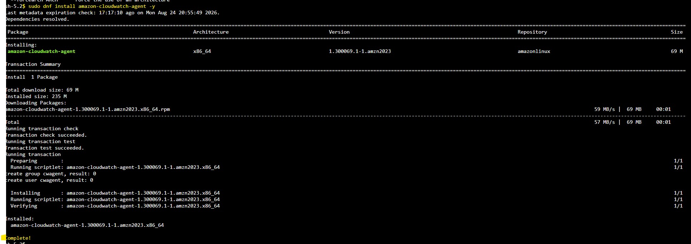
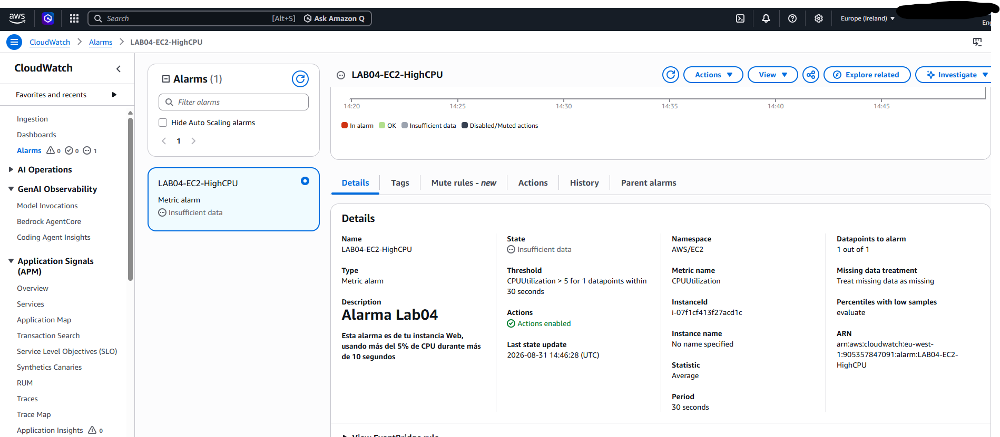
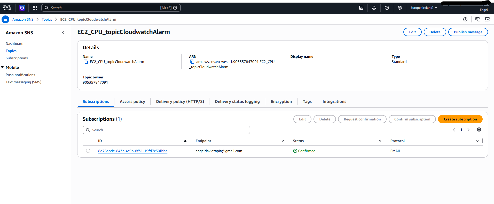
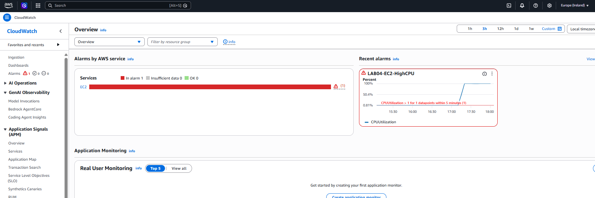
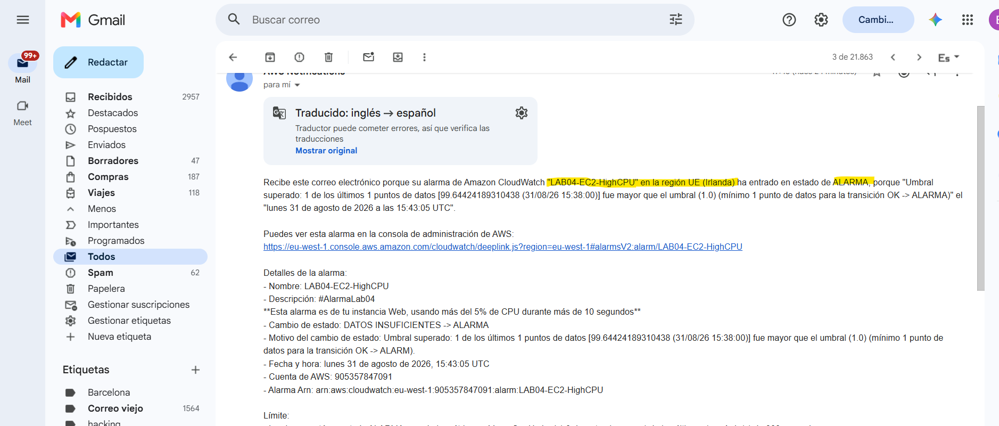
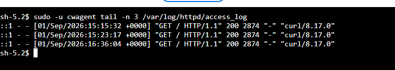
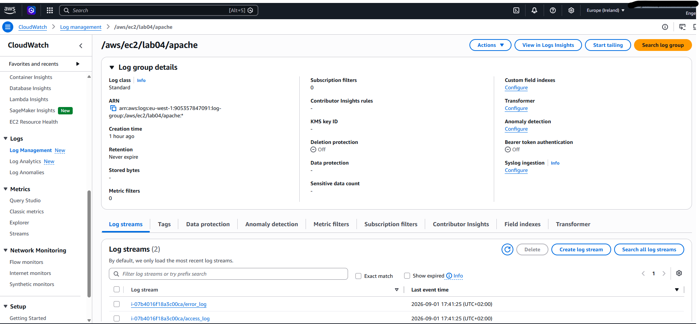

# LAB04 Monitorización de servicios y alarmas


### Conceptos/servicios a tener en cuenta:
**EC2:** es nuestra instancia que hace de servidor

**CloudWatch:** es el centro de métricas, monitorización, logs y alarmas de AWS. Sirve para centralizar métricas de rendimiento de nuestros servicios en un solo sitio.

**CloudWatch Agent:** para recoger métricas de sistema operativo como uso de memoria, disco, que no se recogen por defecto.

**SNS:** es un servicio de mensajería pub/sub, o sea, un mensaje sobre un tópico se envía a los destinatarios suscritos a dichos tópicos. No es enviado en cola, todos a la vez por canales como correo. 

**CloudWatch Alarm:** las alarmas de CloudWatch permiten realizar acciones, mandar mensajes o sólo informar del rendimiento o uso de cómputo que x servicio que hayamos elegido está utilizando. Se debe crear la alarma y elegir en qué circunstancias debe saltar. 


## Resumen del Lab04:
Se recopilarán métricas y logs de una instancia EC2 mediante CloudWatch. Se configurarán CloudWatch Alarms para detectar situaciones anómalas, como un uso elevado de CPU, y se utilizará SNS para recibir notificaciones cuando se active una alarma. Además, se instalará CloudWatch Agent para recopilar métricas adicionales del sistema operativo, como el uso de memoria y disco.


--- 
---
---
### Instalación del Agente de CloudWatch en la EC2

``` bash
sudo dnf install amazon-cloudwatch-agent -y
```




#### Configuraremos el agente:
Entramos en el archivo de configuración JSON -> /opt/aws/amazon-cloudwatch-agent/bin/config.json

``` json
{
        "agent": {
                "metrics_collection_interval": 60,
                "run_as_user": "cwagent"
        },
        "metrics": {
                "append_dimensions": {
                        "AutoScalingGroupName": "${aws:AutoScalingGroupName}",
                        "ImageId": "${aws:ImageId}",
                        "InstanceId": "${aws:InstanceId}",
                        "InstanceType": "${aws:InstanceType}"
                },
                "metrics_collected": {
                        "cpu": {
                                "measurement": [
                                        "cpu_usage_idle",
                                        "cpu_usage_iowait",
                                        "cpu_usage_user",
                                        "cpu_usage_system"
                                ],
                                "metrics_collection_interval": 60,
                                "resources": [
                                        "*"
                                ],
                                "totalcpu": false
                        },
                        "disk": {
                                "measurement": [
                                        "used_percent",
                                        "inodes_free"
                                ],
                                "metrics_collection_interval": 60,
                                "resources": [
                                        "*"
                                ]
                        },
                        "diskio": {
                                "measurement": [
                                        "io_time"
                                ],
                                "metrics_collection_interval": 60,
                                "resources": [
                                        "*"
                                ]
                        },
                        "mem": {
                                "measurement": [
                                        "mem_used_percent"
                                ],
                                "metrics_collection_interval": 60
                        },
                        "swap": {
                                "measurement": [
                                        "swap_used_percent"
                                ],
                                "metrics_collection_interval": 60
                        }
                }
        }
}

```

| Categoría       | Qué recopila                                                      |
| --------------- | ----------------------------------------------------------------- |
| **CPU**         | % CPU libre, esperando I/O, usada por usuario y usada por sistema |
| **Disco**       | % de espacio utilizado y cantidad de inodos libres                |
| **Disk I/O**    | Tiempo que el disco está realizando operaciones de I/O            |
| **Memoria RAM** | % de memoria RAM utilizada                                        |
| **Swap**        | % de memoria Swap utilizada                                       |


Tras tener la configuración deseada ya descrita dentro del archivo y comandos de validación de esta, podemos pasar a crear la alarma que queramos.


# Cloudwatch Alarm

la métrica CPUUtilization de mi instancia EC2 pasa a estado ALARM cuando la CPU supera el 5% durante un periodo de 30 segundos. Es claro que la alarma se disparará fácilmente pero es con fines de demsotración del funcionamiento.


# SNS(Simple Notification Service)

SNS recibe las notificaciones generadas por CloudWatch y las envía a los suscriptores del tópico configurado para la alarma. En este caso, la notificación se recibe mediante correo electrónico personal mío.

---
---
---

# Comprobación de la alarma y mensaje de SNS notificado via correo



Ya puesto el estado de alarma tras abrir programas dentro de la instancia, podemos confirmar que la alarma funciona también porque nos llega un mensaje a nuestro correo gracias a SNS; informando del estado de la alarma.



---
---
---


# CloudWatch Logs

Además de las métricas de rendimiento, se configuró el **CloudWatch Agent** para recopilar los logs generados por el servidor web Apache instalado en la instancia EC2.

Se configuró el agente para recoger los siguientes archivos:

| Archivo                     | Información recopilada                                                                                                                            |
| --------------------------- | ------------------------------------------------------------------------------------------------------------------------------------------------- |
| `/var/log/httpd/access_log` | Registra las peticiones HTTP recibidas por Apache, incluyendo la dirección IP, fecha, recurso solicitado, código de respuesta y agente utilizado. |
| `/var/log/httpd/error_log`  | Registra errores y advertencias generados por Apache durante el funcionamiento del servidor.                                                      |

Los logs se envían a **CloudWatch Logs**, concretamente al Log Group:

```text
/aws/ec2/lab04/apache
```

Dentro de este Log Group se generan diferentes **Log Streams** asociados a la instancia EC2, permitiendo separar y consultar los registros de acceso y de errores.

La configuración añadida al CloudWatch Agent es la siguiente:

```json
"logs": {
    "logs_collected": {
        "files": {
            "collect_list": [
                {
                    "file_path": "/var/log/httpd/access_log",
                    "log_group_name": "/aws/ec2/lab04/apache",
                    "log_stream_name": "{instance_id}/access_log"
                },
                {
                    "file_path": "/var/log/httpd/error_log",
                    "log_group_name": "/aws/ec2/lab04/apache",
                    "log_stream_name": "{instance_id}/error_log"
                }
            ]
        }
    }
}
```

Debido a que el CloudWatch Agent se ejecuta con el usuario `cwagent`, fue necesario proporcionarle permisos de lectura sobre los archivos de log de Apache mediante **ACL (Access Control Lists)**. Esto permite que `cwagent` pueda acceder a los logs sin modificar los permisos generales de la carpeta ni conceder acceso innecesario a otros usuarios.

Para comprobar que el usuario `cwagent` podía acceder correctamente a los logs se utilizó:

```bash
sudo -u cwagent tail -n 3 /var/log/httpd/access_log
```


También se generó tráfico hacia el servidor mediante una petición HTTP:

```bash
curl http://localhost
```

La petición quedó registrada en `access_log` y posteriormente el CloudWatch Agent la envió a CloudWatch Logs.

### Comprobación en CloudWatch

Desde la consola de AWS se puede acceder a:

**CloudWatch → Logs → Log groups → `/aws/ec2/lab04/apache`**


Desde este Log Group se pueden consultar los registros enviados por la instancia EC2.
